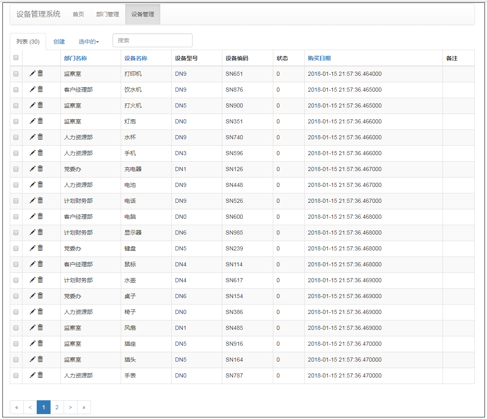

# shebei
设备管理系统



### 下载Python3

#### windows 64位系统下载地址：

国外使用：https://www.python.org/ftp/python/3.6.4/python-3.6.4-amd64.exe

国内使用：http://mirrors.sohu.com/python/3.6.4/python-3.6.4-amd64.exe

#### windows 32位系统下载地址：

国外使用：https://www.python.org/ftp/python/3.6.4/python-3.6.4.exe

国内使用：http://mirrors.sohu.com/python/3.6.4/python-3.6.4.exe

### 设备国内 pip 镜像源（加速安装扩展）


把代码目录中的 pip 目录复制到 $HOME（个人文件夹）

其它操作系统加速方案请看链接：https://www.cnblogs.com/ZhangRuoXu/p/6370107.html

### 下载程序源码

https://github.com/wangyupeng/shebei/releases/tag/v1

或使用 git 下载源码

```git clone git@github.com:wangyupeng/shebei.git

### 3、安装扩展包

解压源码到 d:\shebei 目录 (任何目录都可以，路径不要存在中文)

进入源码目录

```
d:

cd shebei\
```

```pip install -r requirements.txt```

### 运行程序

```python main.py```

### 浏览器打开系统管理界面进行使用

http://localhost:5000
